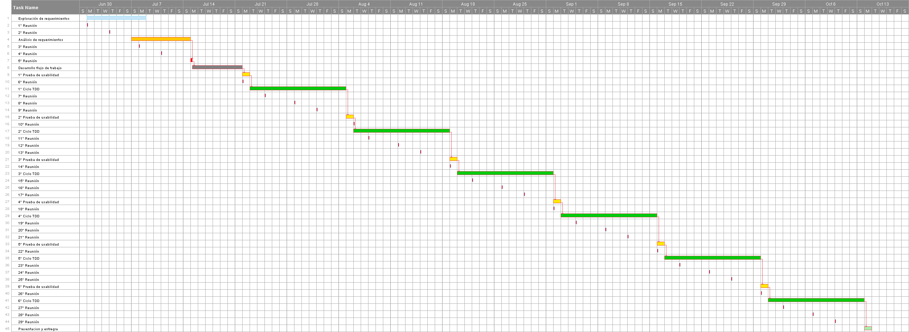

## RESUMEN DEL TRABAJO DE GRADO
```
 TITULO : Plataforma para representación visual de relaciones en el contexto político colombiano (Política Visual)|
 DIRECTOR : Sonia Gamboa
 AUTOR : Andrés Felipe Bayona Chinchilla @afbayonac
 Modalidad : ..
 Costo Total: ...
 Plazo: 16 semanas
 Linea Estratégica de Aporte al desarrollo Regional: Sistemas de información
 Posibles Entidades Interesadas en los resultados: ...
```
####  OBJETIVO GENERAL

Desarrollar una herramienta web para representar y visualizar relaciones en el contexto político colombiano.

#####  DESCRIPCIÓN DE LOS ALCANCES DEL TRABAJO DE GRADO

Este proyecto pretende tres cosas, primero que los ciudadanos colombianos cuenten con una herramienta que le ofrezca datos verificados a cerca de las relaciones políticas colombianas, segundo que esta herramienta genere un espacio en el cual los ciudadanos puedan compartir datos y tercero permitir análisis de posibles conflictos de interés.

## GLOSARIO

* Aplicación
* scrum
* TDD
* fanpage
* servidor
* civic app

### 1. INTRODUCCIÓN

La democratización de la información entendida como libertad que tiene cualquier ciudadano a acceder y publicar saberes u opiniones, desde cualquier lugar y a cualquier hora, fortaleciendo asi la posición del ciudadano y sus derechos. Es ensimismá una meta no se ha alcanzado,  por barreras como el costo, el idioma, la censura entre otras, no obstante y siendo optimistas es una meta que tiene cimentado el camino con la ayuda del Internet. Ahora bien, hemos alcanzado un grado en el cual nos damos cuenda que tener toda la información a nuestro alcancé no es suficiente, es necesario buscar formas organizar, representar y validar los datos.

En la actualidad son cada dez mas las personas que usan las redes sociales como medio de información, por lo que las plataformas tradicionales de difusión se ven forzadas a cambiar su modelo periodístico y económico, intentan competir con con la inmediatez de las redes y renuncian a sus equipos de investigación para bajar costos, lo cual se ve reflejado en la calidad de sus noticias, por otra parte las redes sociales se han convertido en un foco de noticias falsas, la misma libertad que tienen las personas de publicar juega en contra de la veracidad de la información, la responsabilidad de la validación de los datos que antes recaía en manos de las plataformas tradicionales ahora recae en el usuario y esto es un serio problema pues no todos los usuarios cuentan con las capacidades o la motivación necesaria para realizar este procedimiento. 

Antes de proseguir hay que enunciar que ya existen varias guiás que los ciudadanos podemos seguir para  verificar una noticia, existen portales web que se dedican a desmentir noticias y herramientas que describen la confiabilidad de las fuentes.

Organizar y Representar se vuelve crucial cuando manejamos grandes volúmenes de datos; con el objetivo facilitar la interpretación y generar valor añadido, por ejemplo poder generar vistas holisticas de los datos nos permite poder encontrar propiedades de los mismos que no se pueden pueden encontrar en los elementos por separado.

Ahora bien, la democratización del la información en un contento político es es esencial para generar procesos democráticos, facilitar la interpretación de la información y generar procesos de verificación es una labor que nos corresponde a los ingenieros de sistemas.


### 2.	DECLARACIÓN DEL PROBLEMA

En la política colombiana solemos escuchar muchas veces los mismos apellidos, algunos que resuenan mas en el contexto nacional y otros en un contexto Regional, Esto ha dado a dado paso a crear en la conciencia colectiva la idea de "Oligarquía colombiana", la cual posee limites intangibles, no sabemos con certeza quienes son ni que tanto alcance tienen.

Establecer un diagrama mental de las relaciones que se dan en el gobierno Colombiano resulta en una dura tarea, una tarea que debe realizarse cada vez que nos enfrentarnos a las urnas, por cada uno de los 36,805,079 colombianos que podemos ejercer el derecho al sufragio.

La web 2.0 a creado una nueva forma de hacer política, de difundir información, Son muchas los personajes públicos que cuentan con un blog, un canal en Youtube, una fanpage en las redes sociales de moda, estas canales,  les permite desplegar un discurso adecuado  al destinatario.


borbuja de infotmacion
Desde ese punto el internet es un aliado, nos brinda poder, al convertirnos a todos los usuarios en una posible fuente de información, desligando la información de los medios tradicionales de información,


El conjunto de datos que podemos relacionar, es limitado, puesto que las capacidades del ser humano son limitadas, primero  podemos retener una pequeña cantidad de información al tiempo, segundo aunque gracias al internet contamos fuente information casi ilimitada no contamos con las capacidades para accedería, por ultimo nuestro tiempo es limitado.

Esto es problema cuando deseamos tomar decisiones informadas en poco tiempo, en temporada de elecciones nos vemos abrumados con información, grandes campañas publicitarias que intentan dejarnos grabada una frase, planes de gobierno que nos dan esperanza, discursos calculados y debates medidos. Tomar decisiones en estas circunstancias se convierte en un acto de fe.

### 3.	ANTECEDENTES

#### Poderopedia

Poderopedia es una plataforma de código abierto la cual permite manejar la información de personas de interés en la actualidad en la actualidad política de un país, primeramente implementada en Chile y replicada en otros países de América latina como Colombia.

Poderosamente permite almacenar y representar conexiones entre personas y empresas, en función de detectar posibles conflictos de interés. también, consultar y publicar conexiones creadas por los usuarios las cuales pasan a través de un proceso de verificación.

### 4.	MOTIVACIÓN Y JUSTIFICACIÓN

Este proyecto busca darles los ciudadanos una herramienta en la cual puedan realizar investigation política para la toma  de decisiones, practica e intuites el objetivo, puesto que al encontariva, priorizando  la experiencia del usuario, para la toma de decisiones.

### 5.	PROPUESTA

#### 5.1	OBJETIVOS GENERALES

Desarrollar una herramienta web para representar y visualizar relaciones políticas en el contexto colombiano político colombiano.

#### 5.2	OBJETIVOS ESPECÍFICOS

* Establecer un conjunto de elementos y relaciones posibles entre ellos, en el contexto político colombiano.
* Determinar los requerimientos funcionales y no funcionales para una herramienta que represente visualmente este conjunto, que incluyan establecer protocolos y procesos para:
* Adopción y verificación de los datos
* Registro, verificación y validación de usuarios
* Visualización de elementos y relaciones específicas.
* Administración de la plataforma.
* Validar las funcionalidades de la herramienta con un conjunto de expertos y no expertos en política colombiana.

#### 5.3	ALCANCE

El aplicativo se  diseña para represente las relaciones politicas con un alance nacional, ejemplificando: un alcalde en Miraflores, Boyáca con un  cosejal en Ipiales, Nariño. los datos en los cuales nos basaremos para generar estas relaciones se analizar en la fase de requerimientos.

El aplicativo podrá usarse por cualquier individuo con acceso a internet.

#### 5.4	RESULTADOS Y PRODUCTOS

Como resultado de desarrollo se espera una aplicación de código, almacenada en uno o varios repositorios publico bajo una licencia GNU , con toda la documentación necesaria para su despliegue. El código fuente tendrá los comentarios respectivos, respetando las convenciones que se definirán en la tercera semana en base a los requerimientos.

En segundo lugar se espera que la aplicación se encuentre corriendo en un servidor remoto, al cual se pueda acceder desde cualquier navegador web.

Por ultimo se espera contar con todo material de apoyo utilizado en las entrevistas, en el análisis de requerimientos y en las pruebas de usabilidad, como las grabaciones que tomen de estas.

#### 5.5	IMPACTOS ESPERADOS
##### 5.5.1	DIRECTOS

El impacto mas significativo que se busca con el aplicativo generar una medio de divulgación el cual sirva como base para la toma de decisiones políticas   

##### 5.5.2	INDIRECTOS

El aplicativo se vuelva un instrumento de apoyo para la búsqueda de conflictos de interés, en la cual se puedan encontrar  

#### 5.6	METODOLOGÍA Y PLAN DE TRABAJO

el objetivo que buscamos con la siguiente metodología es que el desarrollo tenga una linea claramente iterativa, incremental y con gran flexibilidad a cambios en los requerimientos.




Como podemos observar en el diagrama de grant la idea es comenzar con un ciclo de 2 semanas en las cuales, determinar los requerimientos claves del proyecto, basados en entrevistas, a politicos, analistas politicos y posibles usuarios de la aplicación, y un análisis de las normas que sean relevantes al tratamiento de datos. En estas dos primeras semanas se realizaran reuniones con mi directora para socializar, interpretar y seleccionar los requerimientos relevantes, de los cuales quedara constancia en un informe de requerimientos al cual se adjuntara todo el material de apoyo como son las entrevistas grabadas o los diagramas de casos de uso.

En la tercera semana se realizara la avances técnicos como son la elección de las tecnologías a usar, el desarrollo del flujo de trabajo, el alquiler del hosting, la compra del dominio, y demás actividades requeridas para el comenzar desarrollo.

En las siguientes doce semanas se realizaran 6 ciclos de TDD (desarrollo guiado por pruebas) que comenzaran con el diseño y implementación de una prueba de usabilidad la cual se tendrán en cuenta para la programación de las metas en la concurrente iteración, se realizaran 2 reuniones presenciales o virtuales semanales con mi directora de proyecto en función de revisar los avances y ajustar las metas.


##### Pruebas de usabilidad
##### Entrevistas

##### 5.6.1	ADQUISICIÓN, SELECCIÓN  Y ORGANIZACIÓN DE LA INFORMACIÓN RELEVANTE.
##### 5.6.4	DOCUMENTACIÓN.

Tanto las entrevistas como las pruebas de usabilidad se grabaran

####  5.7	CRONOGRAMA


#### 5.8	RECURSOS Y PRESUPUESTO


#### 5.8.1	Recurso humano

Para la realización del proyecto se cuenta con desarrollador que se encargara de la mayoría de los aspectos del de proyecto, tales como el análisis de requerimientos, entrevistas, pruebas de usabilidad, programación. Y un asesor el cual guiara la toma de decisiones y el desarrollo de la aplicación.

#### 5.8.2	Equipos

En el apartado de los equipos se requiere un computador portátil que se usara con multiples propósitos; desde el diseño de los casos de uso hasta la puesta en marcha del servidor remoto, un monitor externo para apoyar el desarrollo, una impresora que se usara para tener en papel los guiones de las entrevistas, los casos de uso y todo material de soporte necesario , un servidor remoto de desarrollo.

#### 5.8.3	Materiales e insumos

En el desarrollo del análisis de requerimientos se plantea realizar entrevistas a analistas politicos, para ello es muy probable la realización de viajes a la ciudad de Bogota y Medellin, los viajen son requeridos dadas las dinámicas que platean para las entrevistas.

Ya sea para la etapa de codificaron o las reuniones virtuales con el asesor sera necesaria un conexión a internet banda ancha

#### 5.8.5	Software

En en todo lo relacionado con software de terceros, intentaremos hacer uso de herramientas libres, priorizando software gratuito y software que posea un modelo de negocios basado en soporte al mismo.


#### 5.8.5	Costos totales	15

### 6.	REFERENCIAS	16
https://www.registraduria.gov.co/-Censo-Electoral,3661-.html
https://sg.com.mx/content/view/358
Democracia 2.0:
La política se introduce en las redes sociales
David CALDEVILLA DOMÍNGUEZ1

### ANEXOS	16
#### a.1	estado del arte	16
