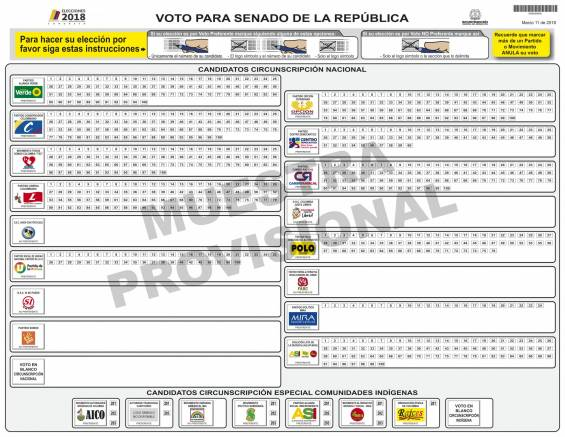
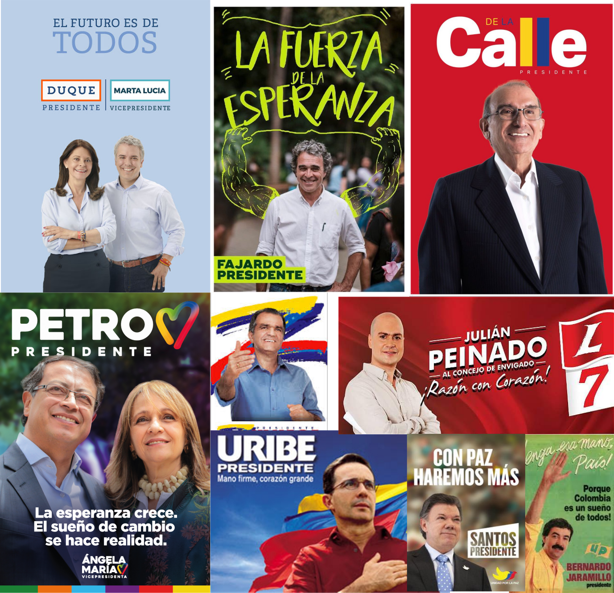
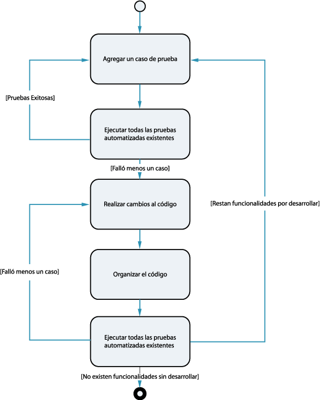

# PLAN DE PROYETCO

### RESUMEN DEL TRABAJO DE GRADO

TÍTULO: Plataforma para representación visual de relaciones en el contexto político colombiano.
DIRECTOR: Sonia Cristina Gamboa Sarmiento
AUTOR: Andrés Felipe Bayona Chinchilla @afbayonac 
MODALIDAD: Trabajo de investigación 
COSTO TOTAL: 25,600,000
PLAZO: 17 semanas 
LÍNEA ESTRATÉGICA DE APORTE AL DESARROLLO REGIONAL: Sistemas de información.
POSIBLES ENTIDADES INTERESADAS EN LOS RESULTADOS: Universidad Industrial de Santander. 

## TABLA DE CONTENIDO 
 
 
- OBJETIVO GENERAL 
- DESCRIPCIÓN DE LOS ALCANCES DEL TRABAJO DE GRADO 
- GLOSARIO 
1. INTRODUCCIÓN 
2. DECLARACIÓN DEL PROBLEMA 
3. ANTECEDENTES
4. MOTIVACIÓN Y JUSTIFICACIÓN
5. PROPUESTA
    5.1. OBJETIVO GENERAL
    5.2. OBJETIVOS ESPECÍFICOS
6. ALCANCE
7. RESULTADOS Y PRODUCTOS
8. IMPACTOS ESPERADOS
9. METODOLOGÍA Y PLAN DE TRABAJO
    9.1. PRUEBAS DE USABILIDAD
    9.2. ENTREVISTAS
10. RECURSOS Y PRESUPUESTO
11. REFERENCIAS
12. CRONOGRAMA

 
## OBJETIVO GENERAL 

Desarrollar una herramienta web para representar y visualizar relaciones en el contexto político colombiano. 
 
 DESCRIPCIÓN DE LOS ALCANCES DEL TRABAJO DE GRADO 
EL desarrollo del proyecto se enfoca en cuatro fases del desarrollo de software, mediante entrevistas a expertos en el panorama político colombiano y un estudio de las leyes de privacidad se realiza el  levantamiento de requerimientos , las fases  de diseño, desarrollo y pruebas,  se introducen en  varios ciclos iterativos,  en los cuales se enfatiza el desarrollo orientado a componentes , y el uso de pruebas unitarias, hay que aclarar que si bien en cada ciclo  se centra en el desarrollo de componentes individuales estos se guiarán en base a las directivas que se definan en el levantamiento de requerimientos. 
Si bien no se incluye la implementación en el alcance del proyecto,  puesto esta incluye estrategias de marketing,  se publicará la herramienta para que pueda ser utilizada por  el público general.

 
## GLOSARIO 
 
Aplicación: Programa o conjunto de programas cuyo objeto es la resolución de un problema mediante el uso de informática.
 
Aplicación Cívica: es un software de aplicación destinado a la participación de los usuarios en el buen desarrollo público. En las sociedades civiles, las aplicaciones cívicas se crean para el mejoramiento del bien público, el compromiso cívico y generalmente el capital social. 

Servidor: Unidad informática que proporciona diversos servicios a computadoras conectadas con ella a través de una red. 
 

## 1. INTRODUCCIÓN 
 
La democratización de la información se entiende, en este proyecto, como la libertad que tiene cualquier ciudadano a acceder a la información de su interés y publicar saberes u opiniones, desde cualquier lugar y a cualquier hora, fortaleciendo así la posición del ciudadano y sus derechos. Esta democratización es en sí misma una meta que no se puede dar por alcanzada, por barreras como el costo, el idioma, la censura, y, sobre todo, la educación de la ciudadanía que despierte interés en los temas políticos y en su responsabilidad sobre los mismos por su rol decisorio. No obstante, este camino parece tener una perspectiva diferente con la Internet. Autores como P. Levy (en Cyberdémocratie e L’Intelligence collective) han descrito ya el impacto que tiene la internet en la configuración de las sociedades democráticas, como el medio que permite tener acceso a cualquier tipo de información y que permite conformar comunidades, alrededor de temas de interés común, no reguladas jerárquicamente Ahora bien, hemos alcanzado un grado en el cual nos damos cuenta que tener toda la información a nuestro alcance no es suficiente, es necesario buscar formas de organizar, representar y validar los datos. Técnicas vigentes, como minería de datos, redes neuronales, bases de datos no relacionales, entre otras, permiten establecer relaciones automáticas entre datos que las personas van dejando en su interacción en la Internet.
Por otra parte, en la actualidad son cada vez más las personas que usan las redes sociales como medio de información, por lo que las plataformas tradicionales de difusión se ven forzadas a cambiar su modelo periodístico y económico, intentan competir con la inmediatez de las redes y renuncian a sus equipos de investigación para bajar costos, lo cual se ve reflejado en la calidad de sus noticias; adicionalmente, las redes sociales se han convertido en un medio de difusión de noticias falsas; la misma libertad que tienen las personas de publicar juega en contra de la veracidad de la información; la responsabilidad de la validación de los datos que antes recaía en manos de las plataformas tradicionales ahora recae en el usuario y esto se constituye en un problema pues no todos los usuarios cuentan con las capacidades o la motivación o la formación necesaria para realizar este procedimiento.  No obstante, a la fecha existen guías que los ciudadanos podemos seguir para verificar una noticia, existen portales web que se dedican a desmentir noticias y herramientas que describen la confiabilidad de las fuentes. 
Las tecnologías de la información –TI– actuales no solo permiten el almacenamiento y administración de grandes volúmenes de datos, sino que su organización y representación facilitan la interpretación y generan valor añadido, por ejemplo, permiten generar vistas holísticas de los datos nos permite poder encontrar propiedades de los mismos que no se pueden encontrar en los elementos por separado. 
Ahora bien, la democratización de la información en un contexto político es esencial para generar procesos democráticos, desarrollar las TI para facilitar la interpretación de la información y generar procesos de verificación es una labor que nos corresponde a los ingenieros de sistemas.   

## 2. DECLARACIÓN DEL PROBLEMA 

En una democracia multipartidista como la colombiana vemos que cada vez aparecen más partidos y que estos más allá de representar ideales y objetivos fijos son plataformas para intereses electorales de sus integrantes, que si bien, no son negativos por sí mismos, afectan el proceso electoral puesto que es cada vez más es difícil reconocer a los candidatos e informarnos sobre ellos. 
 

Figura 1. tarjetón elecciones  senado 2018, periódico El Colombiano.
 
La anterior imagen evidencia la cantidad de candidatos que se presentaban a las elecciones al senado en el 2018. Hacerse una representación mental de las características y relaciones de cada candidato, y retener esa información para compararlos con los demás es una tarea monumental y compleja, dadas las  capacidades limitadas del ser humano.  En la actualidad, con ayuda del internet contamos con una fuente de información abrumadora, pero no contamos con los medios y el tiempo para acceder a esta, ni los recursos para lograr una representación de relaciones entre elementos que pueda llevarse a cabo automáticamente. 
Por otra parte, en la política colombiana, a 200 años del establecimiento de la República de Colombia, lo común es encontrarse con los mismos apellidos una y otra vez, en las noticias, en el congreso y en la misma historia, dando paso a crear un imaginativo común de "oligarquía colombiana" que sería un conjunto de individuos que manejan el poder –político y económico– y el porvenir del país. Si bien puede ser una realidad, es un concepto que posee límites intangibles, no sabemos quiénes son, ni que tanto alcance tienen con certeza. 
Establecer un diagrama mental de las relaciones que se dan en el gobierno es una tarea que los ciudadanos colombianos debemos realizar, un proceso que comúnmente se forma con segmentos de los noticiarios, periódicos, redes sociales y en algunos casos investigaciones puntuales, obteniendo como resultado un boceto precario de la realidad en el contexto que vivimos. Es interesante también enunciar el papel que juega la posverdad, pues sean ciertas o no las noticias que consumimos estas serán parte de este diagrama. 
Frente a este panorama ¿qué hacen los partidos políticos para subsanar en las campañas estas brechas de desinformación?, ¿cómo se promocionan los candidatos, para que tomemos decisiones informadas?, ¿ El proceso electoral nos da las herramientas necesarias? La respuesta es no. La información, al ser dada por los candidatos, carece de imparcialidad, los panfletos publicitarios y las campañas televisivas recitan eslóganes para grabarlos como sellos en las mentes de los votantes. Los debates son espacios de respuestas cortas y sonoras para preguntas complejas y con muchas aristas. 

 
Figura 2. collage de afiches politicos

A veces solemos confundir nuestra democracia representativa con una democracia pura, pues los candidatos se vuelven un paquete de promesas , ideas y planes, y se nos olvida que, si bien son importantes, al final nosotros votamos por personas, que se encargan de tomar las decisiones, reconocerlas como personas es más importante que aprendernos sus promesas.  
 
## 3. ANTECEDENTES 
 
Han existido y existen herramientas que intentan aportar transparencia a los procesos electorales, y a su vez herramientas que ayudan a tomar la decisión de por quién votar; a continuación, se enuncian algunos ejemplos de estas.  
 
### Poderopedia 
Poderopedia es una plataforma de código abierto, la cual permite visualizar la información de personas de interés en la actualidad política de un país, primeramente implementada en Chile y replicada en otros países de América latina como Colombia. Poderopedia permite almacenar y representar conexiones entre personas y empresas, en función de detectar posibles conflictos de interés. También, consultar y publicar conexiones creadas por los usuarios las cuales pasan a través de un proceso de verificación. 
Hay que aclarar que Poderopedia nace con un enfoque enciclopédico, organizado personas y empresas por orden alfabético, mostrando de cada una reseña.  

### Countable - Contact Congress 
Countable es una aplicación diseñada para crear una vía de comunicación entre los estadounidenses y sus representantes en el gobierno, la idea es que las personas opinen sobre la legislación en curso y estas opiniones sean llevadas a sus representantes.

        “busca dar a los ciudadanos una mayor voz en la política nacional” 
        WIRED 
        
        “El servicio en línea de la compañía brinda una visión general simple y concisa de los proyectos de ley que sus representantes nacionales están debatiendo, y permite enviar correos electrónicos a estos representantes, diciéndoles cómo les gustaría que votaran.” 
        WIRED 

### Candidater 
Canditater fue un proyecto financiado por la embajada alemana y operado por VICE COLOMBIA, el cual mostraba la afinidad de una persona con un candidato presidencial a partir de 27 premisas redactadas por 18 jóvenes colombianos, la herramienta cruzaba resultados con las respuestas de los candidatos. 
 Quien es quien 
Quien es quien es una aplicación web que permite buscar y visualizar los perfiles con las relaciones que estos poseen. Siendo una herramienta de la Silla Vacía que nace como resultado de una enciclopedia con los perfiles de más de 400 personajes que hacen parte de los círculos de poder colombiano.

---

Por otra parte, existen Iniciativas ciudadanas que se encarga de ofrecer herramientas para el control y veeduría política. en ejemplo de ello es Fundación ciudadano inteligente situada en Chile, encargada de ofrecer herramientas tecnológicas para fortalecer la democracia en América latina. 
Herramientas tales como: 
- Del dicho al hecho: Que intenta hacer seguimiento a el cumplimento de promesas legislativas. 
- Vota Inteligente: Fue plataforma donde se incentiva a la generación de propuestas desde los  ciudadanos hacia los candidatos. 
- Hay acuerdo: Una herramienta que permite traducir la información compleja de un debate a un formato amigable y claro. 
 
 

## 4. MOTIVACIÓN Y JUSTIFICACIÓN 

El proyecto encuentra su motivación en fortalecer la toma de decisiones en los procesos electorales colombianos, ofreciendo una herramienta que permita realizar investigaciones sobre candidatos y personas de interés. y se justifica en la misión de nuestra Universidad que busca el fortalecimiento de una sociedad democrática. 
 
        MISIÓN UIS 
        La Universidad Industrial de Santander es una institución pública que forma ciudadanos como profesionales integrales, éticos, con sentido político e innovadores; apropia, utiliza, crea, transfiere y divulga el conocimiento por medio de la investigación, la innovación científica, tecnológica y social, la creación artística y la promoción de la cultura; construye procesos colaborativos y de confianza social para la anticipación de oportunidades, el reconocimiento de retos y la construcción de soluciones a necesidades propias y del entorno. Este obrar institucional, dinamizado con redes diversas y abiertas de conocimiento y aprendizaje, busca el fortalecimiento de una sociedad democrática, participativa, deliberativa y pluralista, con justicia y equidad social, comprometida con la preservación del medio ambiente y el buen vivir. 
        
        

## 5. PROPUESTA 
5.1.  OBJETIVOS GENERALES 
Desarrollar una herramienta web para representar y visualizar relaciones políticas en el contexto político colombiano. 

### 5.2.  OBJETIVOS ESPECÍFICOS 
Establecer un conjunto de elementos y relaciones posibles entre ellos, en el contexto político colombiano. 
Determinar los requerimientos funcionales y no funcionales para una herramienta que represente visualmente este conjunto, que incluyan establecer protocolos y procesos para: 
Adopción y verificación de los datos 
Registro, verificación y validación de usuarios 
Visualización de elementos y relaciones específicas. 
Administración de la plataforma. 
Desarrollar y publicar en la web la herramienta .
Validar las funcionalidades de la herramienta con un conjunto de expertos y no expertos en política colombiana. 

## 6. ALCANCE   

Este proyecto se limita a aportar una herramienta al alcance de cualquier colombiano con acceso a internet, en la cual el podrá realizar investigaciones y aportar datos sobre las personas de interés en un ámbito político colombiano. 
El proyecto quedará bajo una licencia de código abierto lo cual permitirá que este sea replicado en cualquier otro contexto o ser modificado por cualquier persona. 
  

## 7.  RESULTADOS Y PRODUCTOS 
Como resultado de desarrollo se entregará una aplicación de código, almacenada en uno o varios repositorios público bajo una licencia Open Source, con toda la documentación necesaria para su despliegue.  El código fuente tendrá los comentarios respectivos, respetando el formato que se defina en el análisis de requerimientos en función de usar un generador de documentación. 
En segundo lugar, se espera que la aplicación se encuentre corriendo en un servidor remoto, el cual permita acceder a la aplicación desde un navegador. 
Por último, se espera contar con todo material de apoyo utilizado en las entrevistas, en el análisis de requerimientos y en las pruebas de usabilidad.
 
## 8. IMPACTOS ESPERADOS 
### 8.1 DIRECTOS 
El impacto más significativo que se busca con el aplicativo generar un medio de divulgación el cual sirva como base para fortalecer la toma de decisiones políticas.  
### 8.2. INDIRECTOS 
El aplicativo se vuelva un instrumento de apoyo para la búsqueda de conflictos de interés.  
 

## 9. METODOLOGÍA Y PLAN DE TRABAJO 

El objetivo que buscamos con la siguiente metodología es que el desarrollo tenga una línea claramente iterativa, incremental y con gran flexibilidad a cambios en los requerimientos. En el proyecto se toma  como referencia SCRUM, un conjunto de prácticas, ancladas al desarrollo incremental, en lugar de una planificación y ejecución completa, que a su vez permite el solapamiento de las fases. 

  Figura 3. Segmento diagrama gantt que hace referencia al cronograma del proyecto.
 
Como podemos observar en el diagrama de gantt la idea es comenzar con un periodo  de 3 semanas en las cuales, determinar los requerimientos claves del proyecto, basados en entrevistas, a políticos, analistas políticos y posibles usuarios de la aplicación, y un análisis de las normas que sean relevantes al tratamiento de datos. En estas dos primeras semanas se realizarán reuniones para socializar, interpretar y seleccionar los requerimientos relevantes, de los cuales quedará constancia en un informe de requerimientos al cual se adjuntará todo el material de apoyo como son las entrevistas grabadas o los diagramas de casos de uso. 
En la cuarta semana se realizarán los avances técnicos como son la elección de las tecnologías a usar, el desarrollo del flujo de trabajo, el alquiler del hosting, la compra del dominio, y demás actividades requeridas para el comenzar desarrollo. 
En las siguientes doce semanas se realizarán 6 ciclos de desarrollo  que comenzarán con el diseño y implementación de una prueba de usabilidad la cual se tendrá en cuenta para la programación de las metas en la concurrente iteración. Seguidamente se llevarán a cabo varios  ciclos de desarrollo guiados por test (TDD Test-driven development),  que implican, en primer lugar escribir pruebas basadas en uno o varios requerimientos, en este caso pruebas unitarias, se verifican que las pruebas fallen, a continuación se implementa el código  que hace que las pruebas pasen satisfactoriamente y finalmente se refactoriza el código. en la figura 4 se explica con más detalle un ciclo TDD.
Paralelamente a lo anterior se realizarán dos reuniones presenciales o virtuales semanales en función de revisar los avances y ajustar las metas. 
 

 Figura 4. Ciclo TDD, Desarrollo guiado por pruebas. Automatización de pruebas unitarias.Tomado de (https://sg.com.mx/content/view/35)

#### Pruebas de usabilidad 
Las pruebas de usabilidad se presentan en metodología como un canalizador del flujo del desarrollo, se plantean para facilitar la toma de decisiones en área del desarrollo. y su metodología se basa en la guía de Steve krug en su libro Don't make me think, a continuación describiré el proceso. 
Con antelación se deberá realizar un guión en base a las tareas que se realizaran, la prueba se desarrollara en una sala con dos sillas una para el evaluador y otra para el participante, el audio de la prueba se grabará como soporte de esta. 
Las entrevistas se dividen en: 
* Una bienvenida (4m) donde se le explica  el proceso al participante. 
* Las Preguntas (2m) se indaga los conocimientos del participante 
* El tour de la página de inicio (3m) donde se le pide al participante que examine la página y diga su impresión sobre esta. 
* Las tareas (35m) En esta parte se le pide al participante se le pide que realice una serie de tareas en el aplicativo. 
* Sondeo (5m) Se le realiza  al participante una serie de preguntas acerca de las tareas realizadas anteriormente. 
* Final (5m) se dan las gracias al participante y le paga y se le muestra la salida. 

Al final de las pruebas se realiza  un documento con los tres problemas de usabilidad más serios con cada participante. 
 
#### Entrevistas 
Las entrevistas se realizar como parte del análisis de requerimientos y se plantean con el fin de aclarar puntos claves como el tipo de relaciones a visualizar. igual que las pruebas de usabilidad se grabaran para tener soporte.

## 10. RECURSOS Y PRESUPUESTO 
 
10.1. Recurso humano 
Para la realización del proyecto se cuenta con desarrollador que será el encargado de la mayoría de los aspectos del de proyecto, tales como el análisis de requerimientos, entrevistas, pruebas de usabilidad, programación. Y un asesor el cual servirá como guía la toma de decisiones y el desarrollo de la aplicación. 
10.2.  Equipos 
En el apartado de los equipos se requiere: 
Un computador portátil que se usará con múltiples propósitos; desde el diseño de los casos de uso hasta la puesta en marcha del servidor remoto 
Monitor externo para apoyar el desarrollo.
Impresora en función tener en papel los guiones de las entrevistas, los casos de uso y todo material de soporte necesario  
 Un servidor remoto de desarrollo. 
 10.3.  Materiales e insumos 
En el desarrollo del análisis de requerimientos se plantea realizar entrevistas a analistas políticos, para ello es muy probable la realización de viajes a la ciudad de Bogotá y Medellín, los viajes son requeridos dadas las dinámicas que plantean para las entrevistas. 
Ya sea para la etapa de codificaron o las reuniones virtuales con el asesor será necesaria una conexión a internet banda ancha.
10.4.  Software 
En todo lo relacionado con software de terceros, intentaremos hacer uso de herramientas libres, priorizando software gratuito y software que posea un modelo de negocios basado en soporte al mismo. 
10.5 Viáticos
En la fase de requerimientos es imprescindible realizar entrevistas a analistas políticos , políticos y politólogos;  la dinámica de las entrevistas busca que nos den información clave de cómo realizan sus trabajos, por lo tanto se considera preferible la realización de reuniones presenciales; se consideran Bogotá y Medellín como dos centros político-económicos que albergan a varios posibles entrevistados. 

10.6 COSTOS  TOTALES  
|||||
|-|-|-|-|
| NOMBRE | VALOR| CANTIDAD | TOTALES |
| Pasajes Bogotá | $160,000 | 1 | $160,000 |
| Pasajes Medellín | $200,000 | 1 | $200,000 |
| Viáticos | $300,000 | 1 | $300,000 |
| Alquiler de oficina | $40,000 | 6 | $240,000 |
| Pago Participantes | $50,000 | 12 | $600,000 |
| Computador | $3,200,000 | 1 | $3,200,000 |
| Impresora | $300,000 | 1 | $300,000 |
| Monitor Externo | $1,200,000 | 1 | $1,200,000 |
| Papelería | $100,000 | 1 | $100,000 |
| Desarrollador (mes) | $3,000,000 | 5 | $15,000,000 |
| Pago Asesor (hora) | $200,000 | 16 | $3,200,000 |
| Servidor (mes) | $180,000 | 5 | $900,000  |
| Dominio | $200,000 | 1 | $200,000 |
||| TOTAL GLOBAL| $25,600,000|

## 11.   REFERENCIAS 

L’Intelligence collective. Pour une anthropologie du cyberespace, La Découverte, Paris, 1994.
Cyberdémocratie. Essai de philosophie politique, Odile Jacob, Paris 2002.
Registraduría Nacional del Estado Civil, CENSO ELECTORAL  recuperado en (https://www.registraduria.gov.co/-Censo-Electoral,3661-.html)
Ariel Súcari, Desarrollo guiado por pruebas. Automatización de pruebas unitarias. SG recuperado en (https://sg.com.mx/content/view/358) 
David Caldevilla Domínguez, Democracia 2.0: La política se introduce en las redes sociales (2009), Universidad de Complutense de Madrid 
Scrum, Wikipedia recuperado en (https://es.wikipedia.org/wiki/Scrum_(desarrollo_de_software) )
Desarrollo guiado por Pruebas, Wikipedia  recuperado en (https://es.wikipedia.org/wiki/Desarrollo_guiado_por_pruebas)
Diego-Alonso Gómez-Aguilar, Francisco-José García-Peñalvo y Roberto Therón, Analitica visual en E-learning (2014) recuperado en (http://www.elprofesionaldelainformacion.com/contenidos/2014/mayo/03.pdf)
ALBERTO CAIRO, INFOGRAFÍA 2.1 recuperado en (http://www.serlib.com/pdflibros/9788498890105.pdf)
Human Rights Action, democratización de la información,  recuperado en (https://www.humanrightsaction.org/information/spanish.html)
Juliana Gragnani, Guía básica para identificar noticias falsas, BBC News Brasil recuperado en (https://www.bbc.com/mundo/noticias-45561204)
Daniel Pacheco, Periodismo colombiano, en crisis, Espectador recuperado en (https://www.elespectador.com/opinion/periodismo-colombiano-en-crisis-columna-738713)
Juancho parada, Periodismo colombiano en crisis: ¿dónde está la salida? – Distractor, El TIEMPO recuperado en (http://blogs.eltiempo.com/esto-le-pasa/2019/03/25/crisis-periodismo-colombian/)
Daniel Coronell: ¿Hay una crisis en el periodismo colombiano?,  El Tiempo recuperado en (http://blogs.eltiempo.com/lecturas-con-santiago-angel/2019/05/30/daniel-coronell-una-crisis-periodismo-colombiano/)
María Teresa Herrán, Medios en crisis, Semana recuperado en (https://www.semana.com/nacion/articulo/medios-crisis/44120-3)
Páginas de Chequeo de la información
FactCheck https://www.factcheck.org/
Polifact https://www.politifact.com/
 
 
1. CRONOGRAMA

